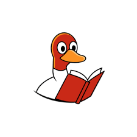

# welcome




🦆🦆🦆🦆🦆🦆🦆🦆🦆🦆🦆

🦆🦆🦆🦆🦆🦆🦆🦆🦆🦆🦆

🦆🦆🦆🦆🦆🦆🦆🦆🦆🦆🦆

🦆🦆🦆🦆🦆🦆🦆🦆🦆🦆🦆

# 🦆 Duckdoc – Centralized Documentation Hub

Welcome to **Duckdoc**, the centralized Git repository for storing and managing documentation across all projects in a unified, CI-friendly way.

## 🧠 Purpose

This repository acts as a **single source of truth** for technical documentation, environment references, architecture diagrams, API specs, and all written knowledge that needs to be shared across teams and projects.

By consolidating docs from multiple services into one place, we enable:

- Easier access and navigation for developers and stakeholders
- Better versioning and history tracking
- Automation via CI/CD pipelines
- Consistent doc structure across projects
- Live doc syncing to applications (e.g., `/app/docs/envs` in Kubernetes)

---

## 📁 Directory Structure

```
/docs
  ├── envs/           # Environment-specific documentation (K8s manifests, env vars, etc.)
  ├── project-a/      # Docs for Project A
  ├── project-b/      # Docs for Project B
  ├── shared/         # Shared or cross-project references
  └── templates/      # Documentation templates and boilerplates
```

---

## 🚀 CI/CD Integration

Integrate Duckdoc into your CI/CD pipelines to:

- Push generated docs (from tools like `Sphinx`, `MkDocs`, or `Swagger`) directly into relevant folders.
- Validate structure or content using linters or markdown checkers.
- Auto-deploy documentation to internal UIs or portals.

---

## 📌 Best Practices

- Organize content under `/<project>/docs/` to avoid conflicts.
- Keep environment files clean, readable, and up-to-date.
- Use meaningful naming and titles for markdown files.
- Include `README.md` files in each subfolder for easy overview.

---

## 🤝 Contributing

To contribute to Duckdoc:

1. Clone this repo.
2. Create or update relevant docs under `/docs/`.
3. Commit changes with clear messages.
4. Open a pull request for review and merge.

---

## 📫 Contact

For questions or onboarding support, reach out to the **Dorsa / Amin**.

---

> 🦆 _Quack wisely. Document everything._
